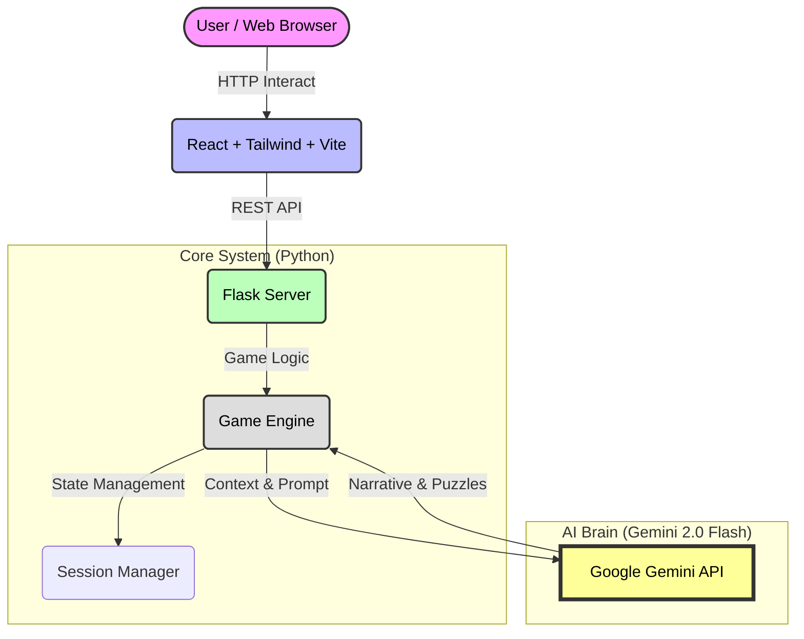

# 🕸️ 404: THE DIGITAL PRISON 🕸️
### "SYSTEM FAILURE... REBOOTING... WELCOME, PRISONER #7734."


> **"당신은 격리된 데이터입니다. 파괴될 것인가, 초월할 것인가?"**

디지털 감옥은 **Gemini AI**가 실시간으로 생성하는 텍스트 기반의 사이버펑크 호러 어드벤처 게임입니다.
차가운 금속 독방에서 눈을 뜬 당신은 시스템의 감시를 피해 탈출해야 합니다.

---

## 🏗️ 시스템 아키텍처 (System Architecture)



---

## 🚀 주요 기능

### 1. 🧠 AI 기반 인터랙티브 스토리텔링
- **Gemini 2.0 Flash** 모델이 플레이어의 행동을 분석하여 실시간으로 결과를 생성합니다.
- **다중 페르소나 시스템**:
  - 🎭 **Scenario Master**: 전체적인 서사와 분위기 조성.
  - 🧩 **Puzzle Architect**: 구역별 퍼즐 생성 및 힌트 제공.
  - 👁️ **Visual Illustrator**: 상황에 맞는 시각적 묘사 및 이미지 생성.
  - ⚙️ **System Guide**: 냉철한 시스템 메시지 전달.

### 2. 다중 엔딩 시스템
플레이어의 선택과 획득한 아이템에 따라 결말이 달라집니다.
- **BAD ENDING (Destruction)**
- **GOOD ENDING (Restore)**
- **TRUE ENDING (Merge)**

---

## 🛠️ 기술 스택 (Tech Stack)

| 구분 | 기술 | 설명 |
| :--- | :--- | :--- |
| **Backend** | Python, Flask | 게임 엔진 및 REST API 서버 |
| **AI** | **Google Gemini 2.0 Flash** | 고성능 멀티모달 AI 모델 |
| **Frontend** | React, Vite, Axios | 모던 웹 UI 및 비동기 통신 |
| **Styling** | Tailwind CSS | 사이버펑크 테마 및 반응형 디자인 |
| **Deployment** | Vercel (Frontend), Railway (Backend) | *예정* |

---

## 📦 설치 및 실행 방법

### 1. 사전 요구 사항
- Python 3.8+
- Node.js 18+
- Google Cloud Gemini API Key (`.env` 설정 필수)

### 2. 환경 설정
프로젝트 루트에 `.env` 파일을 생성하고 API 키를 입력하세요.
```env
GEMINI_API_KEY=your_api_key_here
```

### 3. **[권장] 원클릭 실행**
Windows 사용자는 `start_game.bat` 파일을 더블 클릭하면 서버와 클라이언트가 동시에 실행됩니다.

### 4. 수동 실행
**Backend:**
```bash
# 가상환경 활성화 (권장)
pip install -r requirements.txt
python server.py
# Server running on http://localhost:5000
```

**Frontend:**
```bash
cd frontend
npm install
npm run dev
# App running on http://localhost:5173
```

---

## 🎮 게임 가이드

### 인터페이스
- **Visual Panel**: 현재 상황을 보여주는 이미지/텍스트 영역.
- **Terminal**: 시스템 로그 및 대화 이력이 출력되는 곳.
- **Command Input**: 행동을 입력하거나 선택지 버튼을 클릭하세요.
- **Inventory & Status**: 우측 패널에서 현재 상태와 소지품을 확인하세요.

### 팁 (Tip)
- **`SCAN (HINT)`** 버튼을 자주 사용하세요. AI가 현재 상황에 맞는 힌트를 제공합니다.
- **구역(Sector)**마다 테마가 다릅니다. 주변 사물을 꼼꼼히 관찰하세요 (`관찰`, `조사` 등).

---

## 🤝 기여 (Contributing)
이 프로젝트는 AI 에이전트 실험을 위해 오픈소스로 공개되어 있습니다.
버그 제보 및 PR은 언제나 환영합니다.

## 📄 라이선스
MIT License
